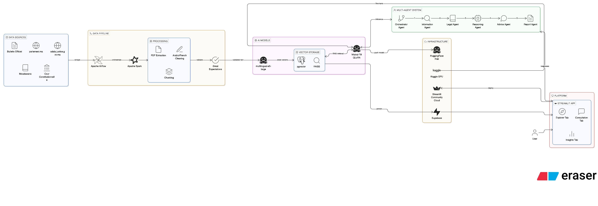

# ميزان · MizanAI
### The First Bilingual AI Legal Assistant for Moroccan Law

<p align="center">
  
</p>

<p align="center">
  
  
  
  
  
  
</p>

---

> **Arabic · French · Darija**
>
> Describe your legal situation. MizanAI finds the applicable Moroccan law,
> explains your rights, and gives you a step-by-step action plan —
> citing the actual Dahir and article number.
>
> *"ميزان" means "the scale of justice" in Arabic.*

---

## What Is MizanAI

In Morocco, a new law can be passed and 30 million people will have no idea
it exists — let alone what it means for their daily lives.

MizanAI is the first domain-specific AI legal assistant for Moroccan law.
It ingests every law published in the Bulletin Officiel, every parliamentary
transcript, and the full Moudawana — processes them with Apache Spark,
fine-tunes Mistral-7B on Moroccan legal text using QLoRA, and serves
grounded, cited legal consultations through a bilingual multi-agent system.

This is not a chatbot that answers general legal questions.
It is a consultation system: you describe your situation,
MizanAI builds your case file, finds the applicable law,
and tells you exactly what to do next.

---

## What Makes It Different

| Feature | ChatGPT / General AI | MizanAI |
|---|---|---|
| Cites actual Dahir numbers | ❌ May hallucinate | ✅ From real Bulletin Officiel |
| Updated with new laws | ❌ Knowledge cutoff | ✅ Weekly automated pipeline |
| Moroccan-specific law | ❌ Generic | ✅ Fine-tuned on Moroccan corpus |
| Arabic + French + Darija | ⚠️ Partial | ✅ Native bilingual |
| Multi-turn consultation | ❌ Single response | ✅ Full case file built |
| PDF consultation report | ❌ | ✅ Downloadable, citable |
| Free, no account needed | ❌ Requires account | ✅ Fully public |

---

## The Stack

| Layer | Tool | Why |
|---|---|---|
| Orchestration | Apache Airflow | 3 DAGs on different schedules |
| Big Data | Apache Spark | Millions of text chunks from PDFs |
| PDF Extraction | PyMuPDF + CAMeL Tools | Arabic RTL extraction |
| LLM Fine-Tuning | Mistral-7B + QLoRA | Domain adaptation, 4-bit quantized |
| Embeddings | multilingual-e5-large | Arabic + French in one vector space |
| Vector Store | FAISS + pgvector | Speed + hybrid SQL queries |
| Multi-Agent | LangChain Agents | 6-agent consultation pipeline |
| RAG Evaluation | RAGAs | Faithfulness + citation precision |
| Experiment Tracking | MLflow | All fine-tuning runs logged |
| Data Quality | Great Expectations | Validation gate before models |
| Platform | Streamlit | Bilingual RTL/LTR UI |

---

## Multi-Agent Architecture

MizanAI uses a 6-agent consultation pipeline inspired by
how a real Moroccan law firm operates:

```
User describes situation (Arabic / French / Darija)
                    ↓
         Orchestrator Agent
         Classifies: Family Law? Labour? Tenant?
                    ↓
         Information Agent
         Asks clarifying questions
         Builds structured case file
                    ↓
         Legal Agent
         Searches Bulletin Officiel + Moudawana
         Finds exact applicable Dahirs + articles
                    ↓
         Reasoning Agent
         Applies law to THIS specific situation
                    ↓
         Advice Agent
         Step-by-step action plan
         Which tribunal, which documents, timeline
                    ↓
         Report Agent
         Generates PDF consultation report
         Arabic + French, with full citations
```

---

## Legal SOPs (v1)

MizanAI v1 handles three legal domains with full consultation flows:

**SOP 1 — Family Law / Moudawana**
Divorce, custody, nafaqa, inheritance, marriage contracts.
Based on the 2004 Moudawana reform.

**SOP 2 — Labour Law**
Dismissal, contracts, working hours, compensation.
Based on Code du Travail (Law 65-99).

**SOP 3 — Tenant Disputes**
Eviction, rent obligations, contract termination.
Based on Law 67-12 on rental contracts.

---

## Data Sources

| Source | Content | Update Frequency |
|---|---|---|
| bulletinofficiel.ma | All laws since 2004 | Weekly |
| adala.justice.gov.ma | Full legal codes | Monthly |
| parlement.ma | Parliamentary transcripts | Weekly |
| Moudawana 2004 | Family code (complete) | Static |
| Cour Constitutionnelle | Constitutional decisions | Monthly |

---

## Project Structure

```
mizan-ai/
├── dags/                   # Airflow DAGs
│   ├── bo_ingestion.py     # Weekly Bulletin Officiel scraper
│   ├── spark_processing.py # Text extraction + cleaning
│   └── rag_refresh.py      # Weekly vector index update
├── spark_jobs/             # PySpark scripts
│   ├── extract_text.py     # PDF extraction at scale
│   └── clean_text.py       # Arabic/French normalization
├── nlp/                    # Model training
│   ├── fine_tuning.py      # QLoRA fine-tuning on Kaggle
│   └── evaluate.py         # RAGAs evaluation
├── agents/                 # Multi-agent system
│   ├── orchestrator.py
│   ├── information_agent.py
│   ├── legal_agent.py
│   ├── reasoning_agent.py
│   ├── advice_agent.py
│   └── report_agent.py
├── rag/                    # RAG pipeline
│   ├── embeddings.py
│   ├── retriever.py
│   └── faiss_index/
├── platform/               # Streamlit app
│   └── app.py
├── data/
│   ├── raw/                # Downloaded PDFs (gitignored)
│   └── processed/          # Parquet files (gitignored)
├── reports/                # Research findings
├── docs/
│   └── architecture.png
├── tests/
├── .env                    # Secrets (gitignored)
├── requirements.txt
└── README.md
```

---

## Getting Started

```bash
# 1. Clone the repo
git clone https://github.com/Ayalem/MizanAI.git
cd MizanAI

# 2. Set up environment
cp .env.example .env
# Fill in your credentials

# 3. Start the pipeline
docker-compose up -d

# 4. Run the platform locally
streamlit run platform/app.py
```

## Research Findings

MizanAI produces 5 original research findings on Moroccan governance
that have never been answered with data:

1. Legislative agenda by topic per year 2019–2024
2. Geographic bias — which regions appear most in legislation
3. Legislative velocity — how long bills take to pass by category
4. Ministry dominance — which ministries drive legislation
5. Press vs Parliament gap — what media covers vs what gets passed

---

## Disclaimer

> MizanAI provides legal **information** only, not legal advice.
> Always consult a licensed Moroccan lawyer (محامي مرسم) for
> representation and personal legal decisions.
>
> ميزان يقدم معلومات قانونية فقط وليس استشارة قانونية.
> استشر محامياً مرسماً للتمثيل القانوني.

MizanAI does not store personal information.
All consultations are anonymous and discarded after the session.


## License

AGPL-3.0 — Free to use, share, and build upon.
If you deploy MizanAI commercially, contribute back.